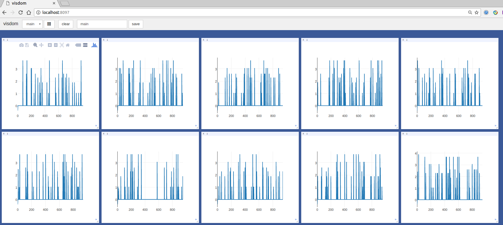

# [Advantage async actor-critic Algorithms (A3C)](https://arxiv.org/abs/1602.01783) in PyTorch

```
@inproceedings{mnih2016asynchronous,
  title={Asynchronous methods for deep reinforcement learning},
  author={Mnih, Volodymyr and Badia, Adria Puigdomenech and Mirza, Mehdi and Graves, Alex and Lillicrap, Timothy P and Harley, Tim and Silver, David and Kavukcuoglu, Koray},
  booktitle={International Conference on Machine Learning},
  year={2016}
}

```

This repository contains an implementation of Adavantage async Actor-Critic (A3C) in PyTorch based on the original paper by the authors and the [TensoFlow implementation](https://github.com/yao62995/A3C) by [yaojian_ict](https://github.com/yao62995).

A3C is the state-of-art Deep Reinforcement Learning method.


## Dependencies
* Python 2.7
* PyTorch
* gym (openai)
* opencv (for env state processing)
* visdom (for visualization)

## Training

### Start visdom server

```
python -m visdom.server
```

### Normal version

```
python train.py
```

### LSTM version

```
python train.py --use_lstm True
```

### Check the loss line of all threads in http://localhost:8097



Continuous versions are still on going.

## References

* [Asynchronous methods for deep reinforcement learning on arXiv](https://arxiv.org/abs/1602.01783)
* [yaojian_ict's implementation in TensorFlow](https://github.com/yao62995/A3C).
